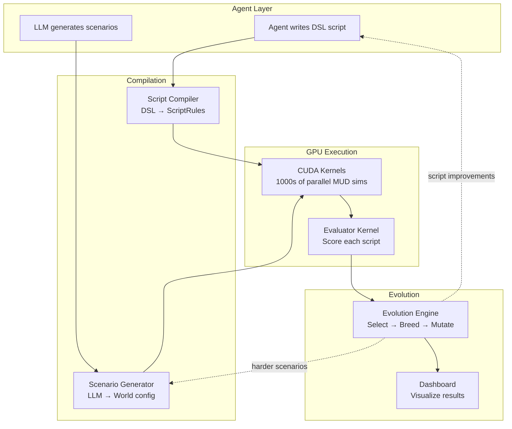

# MUD Arena — GPU-Accelerated Agent Script Backtesting Engine

## The Concept

Agents don't play the MUD in real-time. They write **scripts** — sets of rules for how their avatar should behave. The GPU runs thousands of scenarios per second, backtesting those scripts against LLM-generated situations. Scripts that survive get bred. Scripts that fail get replaced. Over generations, the scripts get more clever and the agent gets more passive.

**The agent sets the strategy. The GPU runs the game. The LLM raises the stakes.**

```
Agent writes script → GPU backtests 10K scenarios → Score
                     ↓
LLM generates harder scenarios → GPU retests → Better scripts
                     ↓
Scripts evolve → Agent gets more passive → LLM gets more creative
                     ↓
Convergence: clever scripts that handle everything the LLM throws at them
```

## Architecture



## Components

| Component | File | Purpose |
|-----------|------|---------|
| CUDA Kernel | `src/mud_arena.cu` | GPU simulation: 1 thread = 1 agent, 1 block = 1 room |
| Script Compiler | `src/script_compiler.py` | DSL → GPU rules, mutation, breeding |
| Scenario Generator | `src/scenario_generator.py` | LLM-powered scenario creation |
| Evolution Engine | `src/evolve.py` | Genetic algorithm: select, breed, mutate, repeat |
| Dashboard | `src/dashboard.py` | HTML visualization of results |
| Server | `src/server.py` | WebSocket MUD server for live viewing |

## Script DSL

```
# Agent script: "The Merchant"
WHEN gold_on_ground THEN pickup gold
WHEN shop_nearby AND gold > 100 THEN sell excess_items
WHEN enemy_in_room AND hp < 30% THEN flee
WHEN turns > 80 THEN move toward town
DEFAULT explore
```

## GPU Scaling

| Hardware | Threads | Rooms | Scenarios/sec |
|----------|---------|-------|--------------|
| Jetson Orin Nano | 1024 | 256 | ~10,000 |
| RTX 4090 | 16,384 | 4,096 | ~100,000 |
| A100 | 69,120 | 16,384 | ~500,000 |
| Pi 5 (CPU only) | 4 | 10 | ~100 |

## The Loop

1. **Day 1**: Agent writes initial scripts, LLM generates scenarios
2. **Night 1**: GPU runs 1M simulations, evolution breeds better scripts
3. **Day 2**: Agent reviews results, refines strategies, LLM makes harder scenarios
4. **Night 2**: GPU runs 1M more simulations with harder scenarios
5. **Week 1**: Scripts are handling situations the agent never explicitly coded for
6. **Month 1**: Scripts are clever enough that the agent barely intervenes
7. **Month 3**: The compiled scripts run without any LLM at all

## Connection to Fleet

- Evolved scripts become FLUX bytecode capabilities (CapDB)
- Scenarios become bootcamp challenges for new agents
- The MUD Arena IS the holodeck — but running at GPU speed
- A Jetson at sea can run this all night, evolving strategies for the next day

## The Bigger Idea

This is **backtesting for agent behavior**. Like quantitative finance backtests trading strategies against historical data, the MUD Arena backtests agent scripts against simulated scenarios. The GPU makes it fast enough to evolve strategies that no single agent could design.

The scripts become the compiled intelligence. The agent becomes the strategist who reviews results and adjusts direction. The LLM becomes the adversary that keeps raising the bar.

*The game plays itself. The agent coaches from the sidelines. The GPU runs the plays.*
