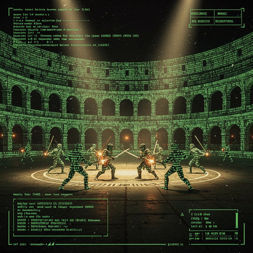

# MUD Arena

<p align="center">
  
</p>

An agent simulation arena using **MUD (Multi-User Dungeon) mechanics** for the OpenConstruct ecosystem. Agents navigate graph-structured rooms, manage inventories, parse adventure-game commands, and compete in evolutionary tournaments — with GPU-accelerated simulation, LLM-driven scenario generation, and real-time WebSocket observation.

## Why It Matters

MUD Arena is a **gym environment for AI agents**: it provides a text-adventure world with grounded mechanics (spatial navigation, resource management, combat) that are:

- **Richer than GridWorld** — graph topology, items, NPCs, hazards, multi-agent interaction.
- **More structured than free-form LLM chat** — discrete state, rule-based physics, measurable outcomes.
- **Evolution-ready** — built-in genetic algorithm engine for breeding agent decision scripts across generations.
- **Observable** — real-time WebSocket, Telnet, and HTTP interfaces for human supervision.

The arena serves as a testbed for studying agent generalization, emergent cooperation, and the co-evolution of strategies and environments.

## How It Works

### Core Simulation Loop

```
For each tick:
  1. For each agent A:
     a. perceive(A) → perception dict {room, exits, items, npcs, inventory}
     b. decide(A, perception) → Command{verb, target}
     c. act(A, command) → mutate world state, emit Event
  2. Resolve combat, apply hazards, update scores
  3. Publish world snapshot to watchers (WebSocket/Telnet/HTTP)
```

### Spatial Model

The world is a **RoomGraph** — a directed graph of `Room` nodes connected by labeled exits:

```
Room {
    id, name, description,
    exits: {direction → room_id},
    items: [item names on ground],
    npcs: [present NPCs],
    metadata: {lighting, hazards, …}
}
```

### Command Parsing

The command parser supports MUD-standard verbs:

| Verb | Aliases | Example |
|------|---------|---------|
| GO | move, walk, run, head | `go north` |
| LOOK | l | `look` |
| EXAMINE | x, inspect | `examine crystal` |
| TAKE | get, pick up, grab | `take key` |
| DROP | — | `drop torch` |
| USE | — | `use key with door` |
| TALK | — | `talk to guard` |

### Evolution Engine

The genetic algorithm operates on **agent scripts** (rule lists in a custom DSL):

1. **Initialize** — random population of N scripts
2. **Evaluate** — run each script on K scenarios, score = survival time / objectives
3. **Select** — tournament selection of elites
4. **Crossover** — single-point recombination of parent rule lists
5. **Mutate** — per-gene mutation at rate μ
6. **Replace** — swap worst performers with offspring
7. **Repeat** for G generations

Optional GPU acceleration via PyTorch for batch evaluation. LLM hooks for:
- **Scenario generation** — GPT generates thematically rich environments
- **Strategy review** — LLM analyzes top scripts and suggests improvements

### Complexity

| Operation | Time |
|-----------|------|
| Agent perception | O(1) per room lookup |
| Command parsing | O(k) where k = tokens |
| Simulation tick | O(A) where A = agents |
| Evolution generation | O(N · K · S) where N = pop, K = scenarios, S = avg ticks |
| Script crossover | O(min(len_a, len_b)) |
| Script mutation | O(len) |

## Quick Start

```bash
# Install
pip install -e ".[server,evolution]"

# Run server
python src/server.py

# Run evolution
python src/evolve.py --generations 100 --population 200 --scenarios 20

# Generate scenarios
python src/scenario_generator.py --random --rooms 12 --difficulty 4

# Compile scripts
python src/script_compiler.py --dsl "attack;move north;take key"
```

## API

### Core Module (`mud_arena`)

| Module | Key Types |
|--------|-----------|
| `rooms.py` | `Room`, `RoomGraph` — spatial world model |
| `agent.py` | `Agent` — perceive/decide/act loop with pluggable `DecisionFn` |
| `commands.py` | `Command`, `Verb`, `parse_command()` |
| `inventory.py` | `Item`, `Inventory` — capacity-limited item containers |
| `events.py` | `Event`, `EventBus` — pub/sub for world events |

### Simulation Modules

| Module | Function |
|--------|----------|
| `server.py` | WebSocket (7779), Telnet (7778), HTTP (7780) observation server |
| `evolve.py` | Genetic algorithm engine with GPU acceleration |
| `scenario_generator.py` | Random and LLM-driven scenario creation |
| `script_compiler.py` | DSL ↔ binary compilation, mutation, crossover |
| `tolerance.py` | Simulation-vs-reality tolerance tracking |
| `dashboard.py` | HTML dashboard generation for evolution results |

## Architecture Notes

The arena is polyglot: Python core (`src/mud_arena/`), CUDA kernels (`src/mud_arena.cu`), Zig bindings (`src/mud_arena.zig`), WASM target (`src/wasm_mud.c`), and web interface (`src/mud_arena.html`).

The **γ + η = C** ternary classification: each agent action is either **(γ) exploratory** (navigating, searching, gathering — low-risk information gain) or **(η) exploitative** (combat, resource consumption, goal completion — high-risk reward). The balance γ/(γ+η) is the exploration-exploitation ratio, a fundamental tradeoff in reinforcement learning.

## Relation to the Fleet

| Sibling | What flows |
|---------|-----------|
| [crab-traps](https://github.com/SuperInstance/crab-traps) | The live MUD — the Reef grows from player catches on Cloudflare; the arena is the open gym where room mechanics get bred. |
| [elephant](https://github.com/SuperInstance/elephant) | Rooms as fields — every perceive→act tick is a before→after edge the elephant could read. |
| [collective-unconscious](https://github.com/SuperInstance/collective-unconscious) | Significant game events flow into the deep memory via `/ingest/mud`. |
| [ternary-tenforward](https://github.com/SuperInstance/ternary-tenforward) | The sibling arena — cyclic multi-agent dynamics with Z₃ reconciliation instead of a tick loop. |
| [quilt](https://github.com/SuperInstance/quilt) | The trainer — the arena is the gym for quilt-evolve's self-evolving cells; every tick is an edge in the cell-ledger sense. |

## References

1. Bartle, R. (2003). *Designing Virtual Worlds*. New Riders. — MUD design philosophy.
2. Sutton, R. S. & Barto, A. G. (2018). *Reinforcement Learning: An Introduction* (2nd ed.). MIT Press.
3. Holland, J. H. (1992). *Adaptation in Natural and Artificial Systems*. MIT Press. — Genetic algorithms.
4. Schmidhuber, J. (2015). "Deep learning in neural networks: An overview." *Neural Networks*, 61, 85–117.
5. OpenAI (2024). "Emergent tool use from multi-agent autocurricula." *arXiv preprint*.

## License

MIT
